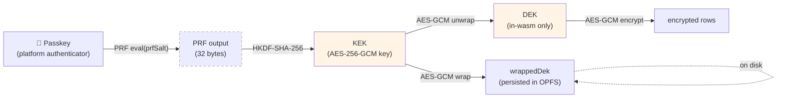

# opfs-webauthn

[](https://github.com/stephane-segning/opfs-webauthn/actions/workflows/ci.yml)
[](LICENSE)

**Local-first, end-to-end encrypted notes PWA.** Identity is a
WebAuthn passkey with the PRF extension; storage is SQLite over OPFS;
crypto and DB row codec live in Rust compiled to WebAssembly.

Live: **<https://ocs.vaam.store>**

> [!IMPORTANT]
> WebAuthn passkeys are bound to the hostname they were enrolled on
> (the `rpId` is baked into each credential). Any vault created on a
> previous hostname cannot be unlocked from a new one. Re-enroll on
> the current live URL to create a fresh vault.

---

## Why this project exists

Most encrypted-notes products solve confidentiality but recreate the
trust assumptions they were trying to escape: a vendor cloud holds
your data and your key material; a password manager syncs your
master key; a recovery service can reset your access. opfs-webauthn
makes a different trade:

- **The key material never leaves your device.** The WebAuthn PRF
  output is hashed into an AES-256-GCM KEK *inside* a WebAssembly
  module — the raw key bytes are never visible to JavaScript.
- **The data never leaves your device by default.** The notes
  database is SQLite running on
  [OPFS](https://web.dev/origin-private-file-system/) in the
  browser's origin-private storage. There is no server-side mirror.
- **Sharing is per-note and opt-in.** When the user explicitly
  shares, an end-to-end-encrypted blob travels through a stateless
  rendezvous service that holds it for 5 minutes — see
  [ADR 0007](docs/adrs/0007-deployment-and-sharing-backend.md). The
  service cannot read the contents.
- **The authenticator is biometric-only.** Touch ID / Windows Hello
  / Android biometrics — explicitly excluding cross-platform
  password-manager authenticators like 1Password or Bitwarden. This
  is an *app-level* posture; the underlying library
  [`@opfs/auth`](packages/auth) is configurable.

The full reasoning lives in the [PRD](docs/prd/) and
[ADRs](docs/adrs/).

## System architecture

```mermaid
flowchart TB
  subgraph Browser["🌐 Browser (cross-origin-isolated, ADR 0013)"]
    direction TB
    UI["React UI<br/>(Next.js static export)"]
    Auth["@opfs/auth<br/>WebAuthn PRF ceremony"]
    Wasm["@opfs/core-wasm<br/>(wasm-bindgen)"]
    Storage["@opfs/storage<br/>sqlite-wasm + OPFS"]
    Share["@opfs/share-client<br/>X25519 + HTTP"]

    UI -->|enroll / unlock| Auth
    Auth -->|PRF output<br/>(in-wasm only)| Wasm
    Wasm -->|wrapped DEK| Storage
    Storage -->|encrypted rows| OPFS[("OPFS<br/>sqlite.db")]
    UI -->|send/receive| Share
  end

  subgraph Authenticator["🔐 Platform authenticator (biometric)"]
    Passkey["Touch ID / Windows Hello /<br/>Android biometric"]
  end

  Auth -.->|"navigator.credentials.*<br/>+ PRF eval(salt)"| Passkey

  subgraph K8s["☁️ Knative cluster"]
    Rendezvous["opfs-share-backend<br/>(Rust + axum, ADR 0012)"]
    Web["opfs-web<br/>(nginx + COOP/COEP, ADR 0013)"]
  end

  Browser -->|"HTTPS<br/>(static assets)"| Web
  Share -->|"HTTPS /api/<br/>encrypted blob + epk"| Rendezvous

  style Wasm fill:#fff4e6
  style Rendezvous fill:#e6f4ff
  style Web fill:#e6f4ff
  style OPFS fill:#f0f0f0
  style Passkey fill:#ffe6f4
```

## Key hierarchy



The **PRF output** and the **DEK** never appear in JS-visible byte
buffers. The wasm module generates the DEK with `getrandom`, wraps
it with the KEK, and only exposes the wrapped blob + the unwrapped
vault handle back to JS. See
[ADR 0005](docs/adrs/0005-webauthn-prf-key-derivation.md).

## Repository layout

```
.
├── apps/
│   ├── web/                    Next.js static export (ADR 0013)
│   └── share-backend/          Rust + axum rendezvous service (ADR 0012)
├── packages/                   JS/TS workspace
│   ├── auth/                   WebAuthn PRF library              ← publishable
│   ├── core-wasm/              wasm-bindgen surface over Rust    ← publishable
│   ├── share-client/           Page-side share orchestration     ← publishable
│   ├── design-tokens/          CSS variables
│   ├── state/                  Zustand stores
│   └── storage/                sqlite-wasm + OPFS plumbing
├── crates/                     Rust workspace
│   ├── crypto/                 AES-GCM, HKDF, X25519, BLAKE3     ← publishable
│   ├── share-protocol/         CBOR envelope types               ← publishable
│   ├── repo/                   Encrypted row codec               ← publishable
│   └── core/                   wasm-bindgen entry point
├── docs/
│   ├── prd/                    What we're building
│   ├── adrs/                   Why each decision was made
│   ├── routing/                Cluster ingress reference manifests
│   └── deploy/                 Kustomize overlay reference
└── .github/workflows/          CI, image build, chart publish, signing
```

## Stack

| Layer | Choice | Reasoning |
|---|---|---|
| Frontend | Next.js 15 (static export), React 19, Tailwind v4 | Output is static HTML+JS; no SSR runtime to defend. [ADR 0013](docs/adrs/0013-self-hosted-frontend.md) |
| State | Zustand | Tiny, no provider tree, plays well with the wasm boundary. [ADR 0009](docs/adrs/0009-state-management.md) |
| Local DB | SQLite via `sqlite-wasm` on OPFS, driven by a SharedWorker | Multi-tab consistency, structured queries, durable. [ADR 0006](docs/adrs/0006-multi-tab-sync.md) |
| Crypto + row codec | Rust compiled to WASM via wasm-bindgen | Memory safety + the DEK never crosses into JS. [ADR 0003](docs/adrs/0003-rust-wasm-boundaries.md), [ADR 0005](docs/adrs/0005-webauthn-prf-key-derivation.md) |
| Identity | WebAuthn passkey + PRF extension, platform authenticator only | No master password; no key manager dependency. [ADR 0005](docs/adrs/0005-webauthn-prf-key-derivation.md) |
| Sharing | Rust + axum rendezvous on Knative, BLAKE3 commitment codes | Server cannot read the blob; 5-min TTL. [ADR 0007](docs/adrs/0007-deployment-and-sharing-backend.md), [ADR 0012](docs/adrs/0012-self-hosted-rust-share-backend.md) |
| Frontend hosting | Self-hosted Knative behind Traefik, COOP/COEP headers | GitHub Pages can't set headers required for `crossOriginIsolated`. [ADR 0013](docs/adrs/0013-self-hosted-frontend.md), [ADR 0014](docs/adrs/0014-runtime-config.md) |
| Image signing | Sigstore cosign keyless via GH Actions OIDC | Verifiable build provenance; no private keys to manage |
| Deploys | ArgoCD GitOps + Image Updater | No `kubectl apply` from CI; digest pins through signed promotion |

## Development

```sh
pnpm install
pnpm dev          # turbo orchestrates per-app dev servers
pnpm build        # production build
pnpm typecheck
pnpm check        # biome lint + format
pnpm test         # vitest where applicable
```

Single app:

```sh
pnpm --filter @opfs/web dev
```

The Rust side is a standard cargo workspace:

```sh
cargo build --workspace
cargo test --workspace
cargo clippy --workspace --all-targets
```

WASM artifact for the frontend:

```sh
pnpm --filter @opfs/core-wasm build
```

## Publishable libraries

Several pieces of this project are designed to stand on their own,
not just power opfs-webauthn. If you want to build something with
WebAuthn-PRF-derived encryption keys, the underlying primitives are
documented and ready to publish to public registries.

### npm

| Package | What it is |
|---|---|
| [`@opfs/auth`](packages/auth) | WebAuthn PRF ceremony driver: `enroll()` / `unlock()` against a configurable authenticator class. |
| [`@opfs/share-client`](packages/share-client) | Page-side client for the recipient-first share rendezvous protocol. |
| [`@opfs/core-wasm`](packages/core-wasm) | wasm-bindgen surface over the Rust crypto crates. Pre-built for browser targets. |

### crates.io

| Crate | What it is |
|---|---|
| [`opfs-crypto`](crates/crypto) | AES-256-GCM row codec, HKDF KEK derivation, X25519 share keys, BLAKE3 commitment codes. `no_std`-friendly. |
| [`opfs-share-protocol`](crates/share-protocol) | CBOR envelope types for the recipient-first rendezvous protocol. |
| [`opfs-repo`](crates/repo) | Encrypted SQL row codec + schema for the notes vault. |

Publishing flows are manual (`workflow_dispatch`) and gated on
`cargo publish --dry-run` / `npm publish --dry-run`. See
[`.github/workflows/publish-npm.yml`](.github/workflows/publish-npm.yml)
and
[`.github/workflows/publish-crates.yml`](.github/workflows/publish-crates.yml).

## Deploying

Reference manifests for ArgoCD + Knative + Traefik + GitHub
Deployments notifications live under
[`docs/deploy/kustomize-example/`](docs/deploy/kustomize-example/).
Fork into your GitOps repo, fill in the URL placeholders, apply.

## Contributing

See [docs/](docs/) for the working agreement and the ADR template.
PRs are scoped small; review by `@codex` and `gemini-code-assist`
typically lands within 15 minutes of opening.

## License

[MIT](LICENSE).
