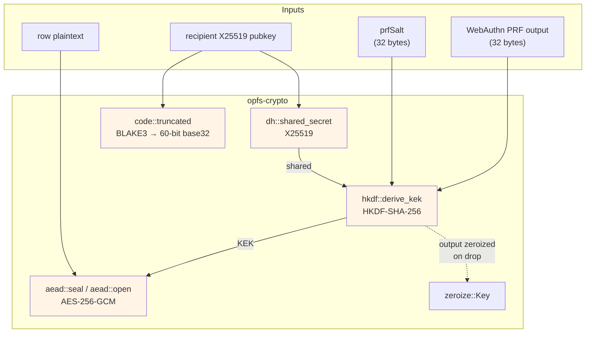

# opfs-crypto

[](https://crates.io/crates/opfs-crypto)
[](https://docs.rs/opfs-crypto)
[](https://github.com/stephane-segning/opfs-webauthn/blob/main/LICENSE)

`no_std`-friendly cryptographic primitives for the opfs-webauthn
local-first vault: AES-256-GCM row wrapping, HKDF-SHA-256 KEK
derivation, X25519 share keys, and BLAKE3 commitment codes. The
crate is the source of truth that powers both the Rust backend and
the WebAssembly-compiled browser side.

> [!NOTE]
> This crate has no platform assumptions outside the HKDF context
> strings and the commitment-code construction. Drop it into any
> Rust project that needs the same primitives.

## What's inside



## Install

```toml
[dependencies]
opfs-crypto = "0.1"
```

For a `no_std` build, the crate compiles without any features
enabled. The optional `getrandom` feature on `rand_core` is only
pulled in for tests — production callers wire their own RNG (the
browser side uses `crypto.getRandomValues` via `getrandom`'s `js`
feature; native callers use `rand_core::OsRng`).

## Quick start

### Vault key wrapping

```rust
use opfs_crypto::{kdf, aead};

// Derive a 32-byte KEK from a WebAuthn PRF output + a 32-byte salt.
let kek = kdf::derive_kek(prf_output, prf_salt)?;

// Generate a fresh DEK (caller-supplied RNG):
let mut dek = [0u8; 32];
rng.fill_bytes(&mut dek);

// Wrap it.
let nonce = aead::random_nonce(&mut rng);
let wrapped = aead::seal(&kek, &nonce, &dek, b"opfs/dek/v1")?;
// `wrapped` and `nonce` are safe to persist; `kek` is zeroized on drop.

// Later, on unlock:
let kek = kdf::derive_kek(prf_output, prf_salt)?;
let dek_again = aead::open(&kek, &nonce, &wrapped, b"opfs/dek/v1")?;
```

### Share commitment

```rust
use opfs_crypto::code;

// Recipient publishes only `epk`. The commitment code is what they
// say aloud to the sender.
let epk: [u8; 32] = recipient.public_key_bytes();
let pickup_code = code::for_pubkey(&epk); // "AB-CDE-FGH-JKM"

// Sender re-derives the code locally from the pubkey it fetched
// from the relay; mismatch ⇒ refuse to encrypt.
assert!(code::verify(&pickup_code, &epk));
```

### X25519 share

```rust
use opfs_crypto::dh;

let recipient = dh::Keypair::generate(&mut rng);
let sender    = dh::Keypair::generate(&mut rng);

let shared_recipient = dh::shared_secret(recipient.secret(), sender.public());
let shared_sender    = dh::shared_secret(sender.secret(), recipient.public());

assert_eq!(shared_recipient.as_bytes(), shared_sender.as_bytes());
// Both sides feed `shared` into HKDF to derive a one-shot AES-GCM key.
```

## Modules

| Module | What it does |
|---|---|
| `aead` | AES-256-GCM seal / open with associated data. Domain-separator AAD per call site. |
| `kdf` | HKDF-SHA-256. KEK derivation from PRF output; share-key derivation from X25519 shared secret. |
| `dh` | X25519 keypair generation + shared-secret derivation via `x25519-dalek`. |
| `code` | BLAKE3-truncated 60-bit commitment codes, Crockford-base32 formatted. |
| `error` | `thiserror`-derived `Error` enum; constant-time `subtle::Choice` comparisons under the hood. |

## Properties

- **No raw key material leaks**: `kdf::Kek` and `dh::SharedSecret`
  implement `ZeroizeOnDrop`. Public byte-bag types are
  intentionally absent.
- **Constant-time comparisons**: nonce-equality, tag-checking, and
  the commitment-code verify path all go through `subtle::ConstantTimeEq`.
- **AAD as domain separator**: every AEAD call site uses a unique
  ASCII tag (`"opfs/dek/v1"`, `"opfs/row/v1"`, `"opfs/share/v1"`)
  so a wrapped DEK can never be substituted into a row-encryption
  context.
- **`no_std`**: works in WebAssembly, embedded, or any host where
  the standard library isn't available. `alloc` is the only
  requirement.

## Testing

```sh
cargo test -p opfs-crypto
```

Covers:

- RFC 5869 §A.1 + §A.2 HKDF test vectors
- AES-GCM round-trip + tamper rejection (ciphertext flip, AAD flip,
  nonce reuse against the same key — the last one is a *negative*
  test: the upstream `aes-gcm` crate forbids nonce reuse and we
  verify our wrappers respect that)
- BLAKE3 commitment code stability across crate versions (frozen
  vectors)
- X25519 round-trip via `x25519-dalek`

The upstream crypto crates ship the full NIST/RFC KAT suites
themselves, so this crate's tests focus on the wiring rather than
re-running them.

## Related crates

- [`opfs-share-protocol`](../share-protocol) — CBOR envelope types
  using these primitives.
- [`opfs-repo`](../repo) — SQL row codec using `aead` + `kdf`.

## License

[MIT](https://github.com/stephane-segning/opfs-webauthn/blob/main/LICENSE).
