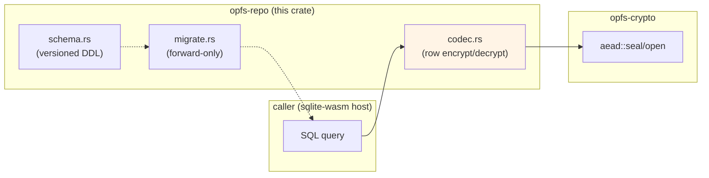

# opfs-repo

[](https://crates.io/crates/opfs-repo)
[](https://github.com/stephane-segning/opfs-webauthn/blob/main/LICENSE)

SQL schema, migrations, and encrypted row codec for the
opfs-webauthn notes vault. Pairs with [`opfs-crypto`][crypto] for
the per-row AES-GCM seal and with `sqlite-wasm` on the
JavaScript side (see [ADR 0004][adr0004]) for the actual database
driver.

> [!WARNING]
> **Pre-implementation.** This crate currently exposes only
> `SCHEMA_VERSION` and a placeholder `current_schema_sql()`. The
> migrations framework and row codec land in the storage
> implementation PR. The published metadata is in place so the
> crate can be released as soon as the implementation does. **Do
> not depend on this crate yet** — the v0.1.0 surface will change
> incompatibly before the first real release.

## Eventual design



The crate will own:

- **Versioned schema DDL.** `SCHEMA_VERSION` const plus the SQL
  text for each version.
- **Forward-only migrations.** Each version transitions cleanly
  from the previous; downgrades are not supported (no in-place
  rewrite back to an older row codec).
- **Per-row AES-GCM codec.** Plaintext columns + an encrypted
  blob column; the codec seals / opens via `opfs-crypto::aead`
  with `"opfs/row/v1"` AAD.
- **No SQL driver.** Drivers are the host's problem
  (sqlite-wasm on the browser side; rusqlite or sqlx on a
  native side).

## What goes encrypted

| Column | Storage |
|---|---|
| `id` | `INTEGER PRIMARY KEY` (plaintext) |
| `created_at`, `updated_at` | `INTEGER` unix-ms (plaintext) |
| `encrypted` | `BLOB`: nonce \|\| AEAD(DEK, payload, AAD) (encrypted) |

Only the metadata that's load-bearing for `WHERE` / `ORDER BY`
queries lives in plaintext. The note body, title, tags, and any
free-text fields go inside the encrypted blob.

## Install

```toml
[dependencies]
opfs-repo = "0.1"  # don't actually pull this yet
```

## Status

Stub. The eventual API surface is sketched above; the first
real release will be 0.1.0 once the codec + migrations land. See
the project roadmap in [docs/prd/01-mvp-scope.md][mvp-scope] for
sequencing.

## Related crates

- [`opfs-crypto`][crypto] — primitives.
- [`opfs-share-protocol`][protocol] — out-of-band share envelopes.

## License

[MIT](https://github.com/stephane-segning/opfs-webauthn/blob/main/LICENSE).

[adr0004]: ../../docs/adrs/0004-sqlite-opfs-storage.md
[crypto]: ../crypto
[protocol]: ../share-protocol
[mvp-scope]: ../../docs/prd/01-mvp-scope.md
