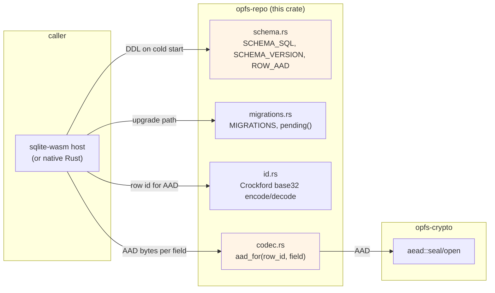

# opfs-repo

[](https://crates.io/crates/opfs-repo)
[](https://docs.rs/opfs-repo)
[](https://github.com/stephane-segning/opfs-webauthn/blob/main/LICENSE)

SQL schema, forward-only migrations, row id codec, and per-field
AES-GCM AAD construction for the opfs-webauthn notes vault. Pairs
with [`opfs-crypto`][crypto] for the actual AEAD primitives and
with `sqlite-wasm` on the JavaScript side (see [ADR 0004][adr0004])
for the database driver.

The crate is `no_std` (uses `alloc`). The same code drives the
browser-side wasm bundle and any native Rust consumer that wants
to speak the same row layout (e.g. a sync tool, an export utility,
or a server that mirrors the schema).

## What's inside



## Install

```toml
[dependencies]
opfs-repo = "0.1"
```

## Quick start

### Schema + migrations

```rust
use opfs_repo::{SCHEMA_VERSION, SCHEMA_SQL, MIGRATIONS, pending_migrations};

// Bootstrap a fresh DB.
let conn = open_my_sqlite()?;
conn.execute_batch(SCHEMA_SQL)?;
conn.execute(
    "INSERT INTO schema_meta(key, value) VALUES('version', ?1)",
    [SCHEMA_VERSION.to_string()],
)?;

// On every cold start, apply outstanding migrations.
let installed: u32 = conn
    .query_row("SELECT value FROM schema_meta WHERE key='version'", [], |r| r.get(0))?
    .parse()?;
for step in pending_migrations(installed) {
    conn.execute_batch(step.up_sql)?;
    conn.execute(
        "UPDATE schema_meta SET value=?1 WHERE key='version'",
        [step.to_version.to_string()],
    )?;
}
```

`MIGRATIONS` is forward-only by design. The vault's row codec
keys on the schema's AAD format ([`aad_for`]); a downgrade that
revives an older AAD construction would either fail authentication
or — worse — accept tampered rows. The driver should refuse to
start when `installed > SCHEMA_VERSION` rather than try to
hand-roll a downgrade.

### Row id codec

```rust
use opfs_repo::{encode_row_id, decode_row_id, ROW_ID_BYTES, ROW_ID_CHARS};

// 16 random bytes → 26 Crockford-base32 chars.
let mut bytes = [0u8; ROW_ID_BYTES];
rng.fill_bytes(&mut bytes);
let id: String = encode_row_id(&bytes)?;  // "00000000000000000000000000"-ish

assert_eq!(id.len(), ROW_ID_CHARS);
assert_eq!(decode_row_id(&id)?.as_slice(), &bytes);
```

The encoder produces uppercase output and accepts mixed-case on
decode. The output is byte-identical to the JS-side encoder in
`packages/storage/src/id.ts` — that's load-bearing because the
AAD includes the encoded id and a one-bit drift between sides
breaks AEAD verification.

### Per-field AAD

```rust
use opfs_repo::aad_for;
use opfs_crypto::aead;

let aad = aad_for(&id, "title");
// AAD bytes: "opfs-webauthn/v1/note-row/title/<rowId>"

let ct = aead::seal(&dek, &nonce, plaintext.as_bytes(), &aad)?;
// store {nonce, ct} into title_nonce / title_ciphertext.
```

`aad_for` produces the exact bytes the JS-side row codec uses
(`packages/storage/src/row-codec.ts` `aadFor`). The construction
is fixed-format `{ROW_AAD}/{field}/{row_id_string}` — see
[`schema::ROW_AAD`] for the prefix.

## Schema

The single user-table is `notes`:

| Column | Type | Plaintext? | Notes |
|---|---|---|---|
| `id` | `BLOB PRIMARY KEY` | yes | 16 random bytes; Crockford-encoded for display |
| `updated_day` | `INTEGER` | yes | days since epoch; day-quantised to hide intra-day timing |
| `archived` | `INTEGER` | yes | 0/1 bool |
| `title_nonce` | `BLOB` | nonce only | AES-GCM nonce for the title |
| `title_ciphertext` | `BLOB` | encrypted | AES-256-GCM ciphertext + 16-byte tag |
| `body_nonce` | `BLOB` | nonce only | AES-GCM nonce for the body |
| `body_ciphertext` | `BLOB` | encrypted | AES-256-GCM ciphertext + 16-byte tag |

Plus a `schema_meta(key, value)` key-value table for the schema
version (`schema_meta.version = current_schema_sql()` after a
fresh DDL).

An index `idx_notes_recent (updated_day DESC, id DESC) WHERE
archived = 0` keeps "list newest unarchived" cheap.

## Properties

- **`no_std`-friendly.** Works in WebAssembly, embedded, or any
  host without the standard library. `alloc` is the only
  requirement.
- **Source of truth.** The schema string, ROW_AAD, and AAD
  construction live in this crate; the JS-side `@opfs/storage`
  currently re-declares the same constants as JS literals, but
  a follow-up PR ports it to consume these values through
  `@opfs/core-wasm` so there's a single canonical definition.
- **AAD as domain separator.** The AAD binds ciphertext to both
  the field name and the row id. Tampering — swapping fields
  across rows, replaying an older row at a different id — fails
  AEAD authentication.
- **Frozen vectors.** The id codec ships JS-derived test vectors.
  If the Rust + JS encoders ever drift, tests fail loudly.

## Testing

```sh
cargo test -p opfs-repo
```

16 cases cover:

- Frozen Crockford encode/decode vectors (zero, all-ones, mixed)
- Decode case-insensitivity + invalid-char rejection
- AAD format and per-field / per-row distinguishability
- Migration list shape (contiguous, last step reaches
  `SCHEMA_VERSION`) and `pending()` boundary conditions

## Related crates

- [`opfs-crypto`][crypto] — primitives (AES-GCM, HKDF, X25519,
  BLAKE3 commitment).
- [`opfs-share-protocol`][protocol] — CBOR envelope types for the
  share rendezvous flow.

## License

[MIT](https://github.com/stephane-segning/opfs-webauthn/blob/main/LICENSE).

[adr0004]: https://github.com/stephane-segning/opfs-webauthn/blob/main/docs/adrs/0004-sqlite-opfs-storage.md
[crypto]: ../crypto
[protocol]: ../share-protocol
[`aad_for`]: src/codec.rs
[`schema::ROW_AAD`]: src/schema.rs
