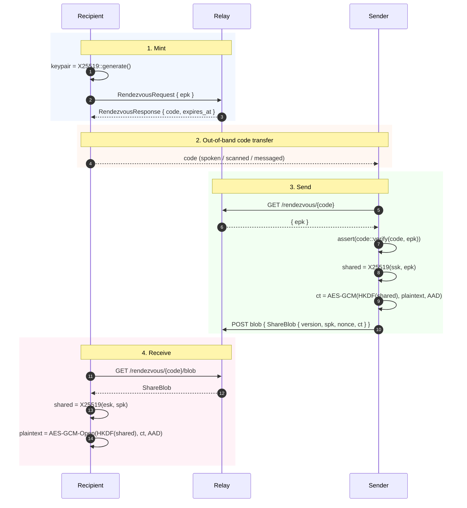

# opfs-share-protocol

[](https://crates.io/crates/opfs-share-protocol)
[](https://docs.rs/opfs-share-protocol)
[](https://github.com/stephane-segning/opfs-webauthn/blob/main/LICENSE)

CBOR envelope types for the **recipient-first rendezvous share
flow** — an end-to-end-encrypted note-passing protocol where the
relay is a verifiably-untrusted intermediary. See
[ADR 0007][adr0007] for the why.

The crate is `no_std` and depends only on [`opfs-crypto`][crypto],
`serde`, and `ciborium`. Any backend implementation (the project's
Knative Rust + axum service; a hypothetical Cloudflare Worker; a
Go relay; …) consumes the same envelope by depending on this
crate.

## Protocol overview



## Install

```toml
[dependencies]
opfs-share-protocol = "0.1"
```

## Envelope types

### `RendezvousRequest`

What the recipient sends to mint a rendezvous:

```rust
pub struct RendezvousRequest {
    /// Recipient's ephemeral X25519 public key.
    pub epk: [u8; 32],
}
```

### `RendezvousResponse`

What the relay returns after a successful mint:

```rust
pub struct RendezvousResponse {
    /// 12-char Crockford-base32 commitment to `epk`.
    pub code: String,
    /// Unix-ms when this rendezvous expires (default 5 min).
    pub expires_at: u64,
}
```

The `code` is derived from `epk` via
[`opfs_crypto::code::for_pubkey`][crypto-code] — both sides
independently re-compute and verify it, so a malicious relay
cannot substitute its own pubkey.

### `ShareBlob`

The encrypted payload the sender uploads:

```rust
pub struct ShareBlob {
    /// Wire format version. Currently 1.
    pub version: u8,
    /// Sender's ephemeral X25519 public key.
    pub sender_pk: [u8; 32],
    /// AES-GCM nonce.
    pub nonce: [u8; 12],
    /// Ciphertext + 16-byte tag, AES-256-GCM with
    /// AAD = "opfs/share/v1".
    pub ciphertext: Vec<u8>,
}
```

## Quick start

### Encoding a request

```rust
use opfs_share_protocol::{RendezvousRequest, encode};

let req = RendezvousRequest { epk };
let bytes = encode(&req)?;          // CBOR-encoded
http_client.post("/rendezvous", bytes).await?;
```

### Decoding a blob

```rust
use opfs_share_protocol::{ShareBlob, decode};

let bytes = http_response.bytes().await?;
let blob: ShareBlob = decode(&bytes)?;
// dispatch on blob.version, etc.
```

## Wire format details

The CBOR envelope is **canonical** — `ciborium` writes definite
lengths and stable field ordering, so a `ShareBlob` round-trips
byte-for-byte. That matters for the relay's content-addressing
(it hashes the blob to detect duplicates).

Cross-language interop: the field names are CBOR text strings
(`"version"`, `"sender_pk"`, `"nonce"`, `"ciphertext"`) so a
JavaScript or Go decoder using a standard CBOR library reads the
same wire bytes.

The HTTP-friendly binary framing used by
[`@opfs/share-client`][shareclient] is **equivalent** to the CBOR
envelope but more compact — a Rust-side bridge implementation can
either accept both shapes or transcode.

## What this crate does NOT do

- **No transport.** It doesn't know HTTP, WebSockets, or any other
  delivery mechanism — just the types on the wire.
- **No state.** A relay implementation owns its store (in-memory
  hashmap, Redis, whatever).
- **No rate-limiting.** Policy lives in the relay.
- **No crypto operations.** This crate carries the *output* of the
  AES-GCM + X25519 operations from [`opfs-crypto`][crypto].

The strict layering means a new relay implementation only needs
this crate + an HTTP framework; the crypto knowledge stays in
`opfs-crypto`.

## Testing

```sh
cargo test -p opfs-share-protocol
```

Covers:

- Round-trip encode/decode for each envelope type
- Rejection of unknown `version` values
- CBOR canonical-encoding invariants (key ordering, definite
  lengths) verified against fixed vectors
- Cross-language sanity: hand-crafted CBOR bytes (matching what a
  JS encoder would produce) decode correctly

## Related crates

- [`opfs-crypto`][crypto] — primitives this envelope wraps.
- [`@opfs/share-client`][shareclient] — page-side TypeScript
  client.

## License

[MIT](https://github.com/stephane-segning/opfs-webauthn/blob/main/LICENSE).

[adr0007]: ../../docs/adrs/0007-deployment-and-sharing-backend.md
[crypto]: ../crypto
[crypto-code]: ../crypto/src/code.rs
[shareclient]: ../../packages/share-client
