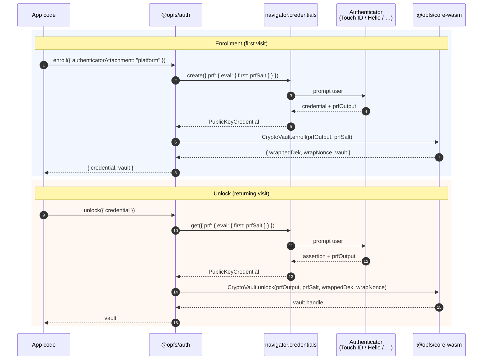

# @opfs/auth

WebAuthn PRF enrollment and unlock orchestration. The JS-side bridge
of the key hierarchy described in [ADR 0005][adr0005]: turn a
passkey into a wrapped DEK that lives next to your encrypted data,
without ever exposing the raw key material to JavaScript.

> [!NOTE]
> This package drives the **browser ceremony**. The actual crypto
> happens inside [`@opfs/core-wasm`][corewasm] — the **DEK** and
> the derived **KEK** never appear in JS-visible buffers. The PRF
> output itself briefly crosses through JS (the WebAuthn API
> returns it as a `Uint8Array`); the ceremony hands it to wasm
> on the next tick without writing it anywhere.

## What it does



## Install

```sh
npm install @opfs/auth @opfs/core-wasm
# or
pnpm add @opfs/auth @opfs/core-wasm
```

`@opfs/core-wasm` is a hard dependency — the ceremony hands the PRF
output to a wasm module that does the actual key derivation.

## Quick start

```ts
import {
  enroll,
  unlock,
  credentialStore,
  type VaultCredential,
} from "@opfs/auth";

// First visit: enrol a passkey, get an open vault back.
const { vault, credential } = await enroll({
  authenticatorAttachment: "platform", // biometric only — see below
  userName: "my-vault",
});
await credentialStore.set(credential);

// Returning visit: re-derive the same vault from the stored handle.
const stored = await credentialStore.get();
if (stored) {
  const vault = await unlock({ credential: stored });
  // `vault` is a CryptoVault from @opfs/core-wasm; pass it to
  // your storage layer to encrypt/decrypt rows.
}
```

## Public surface

### Functions

#### `enroll(options?: EnrollOptions): Promise<EnrollResult>`

Drives a `navigator.credentials.create()` with the PRF extension,
hands the PRF output to the wasm module, and returns a vault handle
plus the `VaultCredential` blob you must persist for unlock.

#### `unlock(options: UnlockOptions): Promise<CryptoVault>`

Drives a `navigator.credentials.get()` against the stored
`VaultCredential`, re-derives the KEK, unwraps the DEK inside the
wasm module, and returns the vault handle.

#### `detectSupport(): AuthFeatureSupport`

Best-effort feature detect. WebAuthn is queryable; the PRF
extension's presence is not directly observable from JS — the
function returns `"unknown"` for `prfExtension` and lets the
enrollment flow fall back to an error if PRF is missing.

### Types

```ts
type EnrollOptions = {
  rpId?: string;              // defaults to location.hostname
  userName?: string;          // defaults to "vault"
  userHandle?: Uint8Array;    // 16+ random bytes; auto-generated if omitted
  authenticatorAttachment?: "platform" | "cross-platform"; // see below
};

type UnlockOptions = {
  credential: VaultCredential;
};

type VaultCredential = {
  readonly credentialId: Uint8Array;
  readonly prfSalt: Uint8Array;
  readonly wrappedDek: Uint8Array;
  readonly wrapNonce: Uint8Array;
  readonly rpId: string;
  readonly createdAt: number;
};
```

### Errors

- `AuthUnsupportedError` — WebAuthn isn't available, the PRF
  extension is missing, or the credential's
  `authenticatorAttachment` doesn't match what the caller
  requested.
- `AuthCeremonyError` — the user cancelled, the authenticator
  refused, or the ceremony timed out. Safe to retry.

## Configuring the authenticator class

Most apps probably want **platform authenticators** (Touch ID,
Windows Hello, Android biometrics) — keys that live on the device
and never sync. Pass `authenticatorAttachment: "platform"` to
enforce that. The library default is `undefined` (any
authenticator).

```ts
// "Platform only" — biometric, on-device, no cloud sync.
// Rejects 1Password / Bitwarden / YubiKey / etc.
await enroll({ authenticatorAttachment: "platform" });

// "Cross-platform only" — roaming, lives in a credential manager.
await enroll({ authenticatorAttachment: "cross-platform" });

// Any — the library default.
await enroll();
```

The constraint is enforced **twice**: as a hint to the browser
(via `authenticatorSelection.authenticatorAttachment`), AND as a
post-condition check (`credential.authenticatorAttachment` must
match). Some browsers surface cross-platform options regardless of
the hint; the second check rejects those credentials before any
data is wrapped.

## Credential persistence

`credentialStore` is a small pluggable adapter:

```ts
type CredentialStore = {
  readonly get: () => Promise<VaultCredential | null>;
  readonly set: (credential: VaultCredential) => Promise<void>;
  readonly clear: () => Promise<void>;
};
```

The default singleton persists to OPFS as
`opfs-webauthn-vault.json`. The credential metadata is small,
multi-tab-visible-via-the-OPFS-watcher, and survives reloads. It's
**not** in localStorage on purpose — that surface shows up alarmingly
in DevTools and gets nuked by "clear cookies" even though the
wrapped DEK is useless without the passkey.

Substitute your own implementation by importing `credentialStore`
re-exports' shape — the `enroll`/`unlock` functions don't depend on
where the credential lives.

## What stays on the device

- The **PRF output** — read directly from the WebAuthn extension
  result, passed into the wasm module, then dropped. Never written
  to disk; never crosses into a JS-visible buffer that lives past
  the ceremony.
- The **DEK** — generated inside the wasm module via
  `crypto.getRandomValues` (`getrandom` Rust crate with the `js`
  feature). Wrapped immediately with the KEK; the wrapped form is
  what JS sees.

## What gets persisted

The `VaultCredential` blob the store holds — it's safe at rest
because **it doesn't include the DEK**:

```
{
  credentialId:  Uint8Array,  // looked up by navigator.credentials.get
  prfSalt:       Uint8Array,  // fed to PRF eval — needs the passkey to be useful
  wrappedDek:    Uint8Array,  // AES-GCM ciphertext, useless without KEK
  wrapNonce:     Uint8Array,
  rpId:          string,
  createdAt:     number,
}
```

Even an attacker with full read-write OPFS access can't open the
vault without the passkey.

## Browser support

- **Chrome / Edge** (Chromium ≥ 132): full PRF support; platform
  authenticators land on Touch ID / Windows Hello / Android.
- **Safari** (17+): PRF supported on macOS Sonoma+ and iOS 17+.
- **Firefox** (≥ 122 with PRF on): support behind flag historically;
  shipping by default in current builds.

PRF is the load-bearing extension. If `prf.results.first` is missing
from the credential response, `enroll`/`unlock` falls back to a
follow-up `get()` to fetch it; if THAT also returns nothing, the
function throws `AuthUnsupportedError`.

## Testing

The WebAuthn ceremony itself isn't unit-testable under vitest/Node
— it requires a real browser + authenticator. What ships with
tests:

- `codec.test.ts` — base64url round-trip used for the persisted
  blob (4 cases, vitest).

The ceremony is covered by manual QA against the live app +
platform authenticators on each supported browser.

## Status

Pre-1.0; API surface may change between minor versions. Once the
data model in [`@opfs/storage`][storage] and the share flow in
[`@opfs/share-client`][shareclient] stabilise together, this
package will follow them to 1.0.

## License

[MIT](https://github.com/stephane-segning/opfs-webauthn/blob/main/LICENSE).

[adr0005]: ../../docs/adrs/0005-webauthn-prf-key-derivation.md
[corewasm]: ../core-wasm
[storage]: ../storage
[shareclient]: ../share-client
