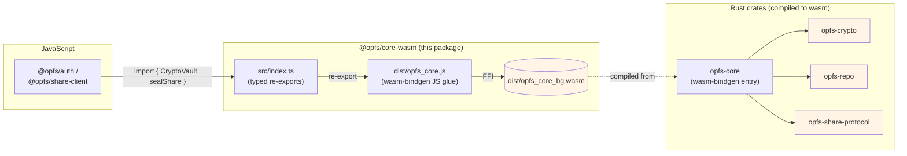

# @opfs/core-wasm

wasm-bindgen surface over the Rust crates that hold the actual
cryptography for opfs-webauthn: AES-256-GCM vault wrapping, HKDF
KEK derivation, X25519 share keys, BLAKE3 commitment codes.

This package is the **JavaScript-visible boundary**. The raw key
material lives in WebAssembly linear memory and never crosses into
JS-visible byte buffers — see [ADR 0005][adr0005].



## Install

```sh
npm install @opfs/core-wasm
```

The package ships pre-built `dist/` artifacts
(`opfs_core_bg.wasm` + `opfs_core.js` glue). Consumers don't need
a Rust toolchain.

## Quick start

```ts
import init, {
  CryptoVault,
  sealShare,
  codeForPubkey,
  PROTOCOL_VERSION,
} from "@opfs/core-wasm";

// One-time: load the .wasm.
await init();

// Enroll a fresh vault from a WebAuthn PRF output:
const enrolled = CryptoVault.enroll(prfOutput, prfSalt);
// `enrolled.wrappedDek` and `enrolled.wrapNonce` are Uint8Arrays
// safe to persist; the DEK itself stays inside wasm.
const vault = enrolled.takeVault();
```

Most consumers won't import this package directly — `@opfs/auth`
and `@opfs/share-client` wrap the relevant entry points with
JS-friendly APIs.

## What's exposed

### `CryptoVault`

The vault handle. Wraps a DEK inside wasm; AES-GCM-encrypts /
decrypts rows on call.

- `static enroll(prfOutput, prfSalt) → EnrollResult` — generate a
  fresh DEK, wrap with the KEK derived from
  `HKDF(prfOutput | prfSalt)`, return the wrapped form + a vault
  handle.
- `static unlock(prfOutput, prfSalt, wrappedDek, wrapNonce) → CryptoVault`
  — re-derive the KEK, unwrap the DEK, return the vault handle.
- `encryptRow(plaintext, nonce) → ciphertext` /
  `decryptRow(ciphertext, nonce) → plaintext` — per-row sealing.
- `free()` — release the wasm allocation. **Must be called** when
  the vault is no longer needed; otherwise the DEK lingers in
  wasm memory.

### Share primitives

- `RecipientHandle` — wasm-owned X25519 keypair for the receive
  side of a share rendezvous.
- `sealShare(epk, plaintext) → SealedShare` — sender-side
  encryption against a recipient's pubkey.
- `codeForPubkey(epk) → string` — BLAKE3-truncated commitment
  code for the share rendezvous protocol.
- `verifyCode(code, epk) → boolean` — local commitment check.

### Constants

Mirror the Rust constants so callers can use them in static
positions (type bounds, default arrays) without first awaiting
`init()`:

```ts
export const PROTOCOL_VERSION = 1;
export const X25519_PUBKEY_LEN = 32;
export const COMMITMENT_CODE_LEN = 12;
export const DEK_LEN = 32;
export const AES_GCM_NONCE_LEN = 12;
export const AES_GCM_TAG_LEN = 16;
```

## Memory ownership

Anything coming back as a wasm-bindgen handle (`CryptoVault`,
`RecipientHandle`, `EnrollResult`) carries native memory you have
to release explicitly:

```ts
const vault = CryptoVault.unlock(prf, salt, wrapped, nonce);
try {
  // … use vault.encryptRow / decryptRow …
} finally {
  vault.free(); // mandatory
}
```

Forgetting `.free()` doesn't crash but leaks wasm-linear-memory
until the page reloads. `@opfs/auth`'s `enroll` / `unlock` calls
are wrapped so this is handled for you; if you use this package
directly, you own the cleanup.

## Building from source

```sh
pnpm --filter @opfs/core-wasm build
```

Runs `wasm-pack build ../../crates/core --target web --release`.
Pinned to `WASM_PACK_VERSION=0.13.1` in the project's Dockerfile so
the released artifact bytes are reproducible.

## Why a separate package

The Rust workspace produces a single wasm artifact via
`crates/core` (the wasm-bindgen entry point). Bundling that
artifact through npm separately from `@opfs/auth` and
`@opfs/share-client` lets each library declare it as a hard
dependency at a pinned version, instead of every consumer having
to figure out wasm-pack themselves.

## License

[MIT](https://github.com/stephane-segning/opfs-webauthn/blob/main/LICENSE).

[adr0005]: ../../docs/adrs/0005-webauthn-prf-key-derivation.md
