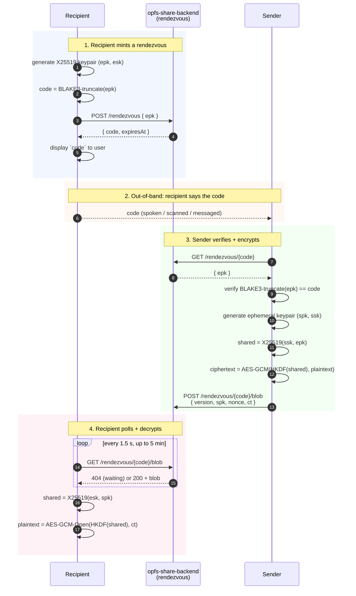

# @opfs/share-client

Page-side client for the recipient-first share rendezvous protocol
([ADR 0007][adr0007]). Wraps the HTTP transport and the WASM
seal/open bindings into a small three-verb surface so the UI
doesn't have to know how the protocol fits together.

The protocol is **end-to-end encrypted with a verifiably-untrusted
relay**: the server holds an opaque ciphertext for at most a few
minutes and can never read it, regardless of who runs the relay.

## How sharing works



The relay never sees the X25519 private keys or the plaintext. The
commitment check (step 9) means **a malicious relay can't
substitute its own pubkey** for the recipient's — the sender would
notice the mismatch and refuse to encrypt.

## Install

```sh
npm install @opfs/share-client @opfs/core-wasm
# or
pnpm add @opfs/share-client @opfs/core-wasm
```

## Quick start

```ts
import {
  RendezvousClient,
  prepareReceive,
  pollAndDecrypt,
  sendShare,
} from "@opfs/share-client";

const client = new RendezvousClient({
  baseUrl: "https://opfs-share-backend.example.com",
});

// ─── Recipient side ────────────────────────────────────────────
const session = await prepareReceive(client);
console.log("Read this code aloud:", session.code);

const plaintext = await pollAndDecrypt(client, session, {
  intervalMs: 1500,        // server is sized for this cadence
  timeoutMs: 5 * 60_000,   // matches the rendezvous TTL
});
// `plaintext` is Uint8Array — decode however your domain wants.

// ─── Sender side ───────────────────────────────────────────────
await sendShare(client, codeFromRecipient, noteBytes);
```

## Public surface

### `RendezvousClient`

Thin HTTP transport. One instance per `baseUrl`; methods are
stateless so the same client serves both recipient and sender
roles concurrently.

```ts
new RendezvousClient({
  baseUrl: string,             // strip trailing slash; "/api" works for same-origin
  fetch?: typeof fetch,        // injectable for tests
});

client.mint(epk: Uint8Array, opts?): Promise<{ code, expiresAt }>
client.fetchEpk(code: string): Promise<Uint8Array>
client.uploadBlob(code: string, blob: Uint8Array): Promise<void>
client.tryDownloadBlob(code: string): Promise<Uint8Array | null>
```

### `prepareReceive(client) → ReceiveSession`

Mints a recipient X25519 keypair (inside wasm), publishes the
public half, and returns:

```ts
type ReceiveSession = {
  readonly code: string;       // human-readable, base32-cased
  readonly expiresAt: number;  // unix ms
  // … internal handle for pollAndDecrypt to consume
};
```

The private key lives in the wasm `RecipientHandle` and is freed
automatically when `pollAndDecrypt` finishes (success or failure).

### `pollAndDecrypt(client, session, opts) → Uint8Array`

Long-polls `GET /rendezvous/{code}/blob` at `intervalMs`, decrypts
the first non-404 response, returns the plaintext. Aborts after
`timeoutMs` with a typed `ShareError`.

### `sendShare(client, code, plaintext)`

Fetches the recipient's pubkey, verifies the local
BLAKE3-truncated commitment matches the displayed `code`,
encrypts, uploads. Throws `ShareError("commitment")` on mismatch —
never sends to an unverified relay-supplied key.

## Errors

`ShareError` carries a `kind` field for predictable branching:

| `kind` | Meaning |
|---|---|
| `network` | `fetch` itself failed (CORS, DNS, offline) |
| `protocol` | Server response shape wrong (malformed JSON, missing field) |
| `notFound` | 404 — rendezvous code never existed |
| `expired` | 410 — rendezvous past its TTL |
| `forbidden` | 403 — origin not in the server's allow-list |
| `conflict` | 409 — blob already uploaded for this code |
| `rateLimited` | 429 — too many mints from this IP |
| `commitment` | Local: pubkey didn't match the spoken code |
| `unauthorized` | 401 — backend rejected the request shape |
| `server` | 5xx |

## Wire format

The blob staged on the backend is a fixed binary framing:

```
┌─────────┬─────────────────┬─────────┬──────────────┐
│ ver(u8) │ senderPub (32B) │ nce(12) │ ciphertext   │
└─────────┴─────────────────┴─────────┴──────────────┘
  = 1                                    AES-GCM(HKDF(X25519(esk,spk)), plaintext)
```

The Rust crate [`opfs-share-protocol`][protocol] carries the same
fields as a CBOR envelope; a Rust↔JS interop helper can be added
when a Rust-side sender or receiver lands.

## Threat model

The backend is treated as untrusted. The protections:

- **The relay can't read plaintext.** AES-GCM with a key derived
  from X25519(esk, spk); neither private key leaves the
  participants.
- **The relay can't substitute keys.** The recipient publishes
  only `epk`; the sender re-derives the commitment locally and
  refuses to encrypt against a tampered key.
- **The relay can't replay.** Each rendezvous code is a one-shot
  resource — a second `POST /rendezvous/{code}/blob` returns 409.
  And the code itself has a 5-minute TTL.
- **The relay can't enumerate.** Codes are 60-bit random; rate
  limits cap mints per IP at 10/window.

What the relay *can* do (by design):

- Observe traffic patterns (sender and recipient IPs visit at
  similar times).
- DoS by refusing service.
- Hold ciphertext until the TTL expires.

## Tests

```sh
pnpm --filter @opfs/share-client test
```

32 cases across:

- `codec.test.ts` — base32-cased code round-trip
- `transport.test.ts` — HTTP error mapping (network, 403, 404, 409,
  410, 429), URL composition (trailing slash strip, relative path
  resolution), abort signal propagation
- `blob.test.ts` — binary framing encode/decode, version
  rejection, length validation

## Companion crates

- [`opfs-share-protocol`][protocol] — CBOR envelope types if you're
  building a Rust client/relay.
- [`opfs-crypto`][crypto] — the X25519 + AES-GCM + BLAKE3 commitment
  primitives, `no_std`-friendly.

## License

[MIT](https://github.com/stephane-segning/opfs-webauthn/blob/main/LICENSE).

[adr0007]: ../../docs/adrs/0007-deployment-and-sharing-backend.md
[protocol]: ../../crates/share-protocol
[crypto]: ../../crates/crypto
